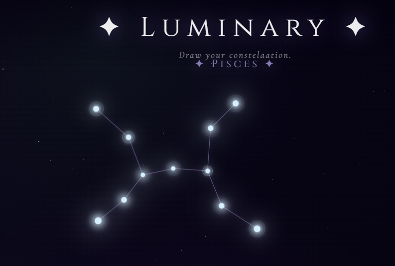

# LUMINARY ✨
A pretty UI just to make constellations. 

### Demo Link: [https://helloiamsuchi.github.io/luminary/]

## Uses? 
- Place a star
- Connect them
- Name it
- Save it or Clar it (You choice) 
Ps - You can also change the colors😀

## HOW IT LOOKS -

